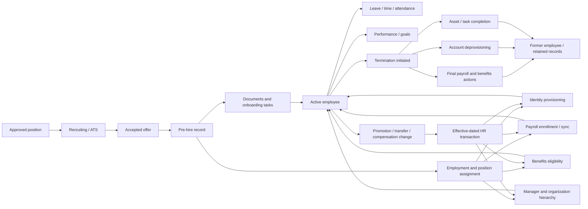
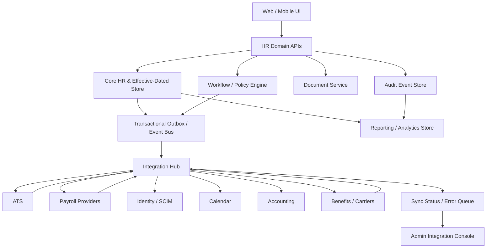
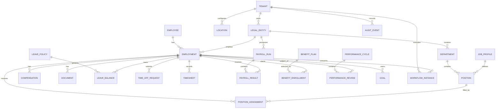

# Comprehensive Feature Blueprint for an HR Management SaaS Platform

## Executive summary

A competitive HR management SaaS product should be designed as a **system of record plus a workflow, policy, and integration platform**, rather than as a collection of isolated HR screens. Current product portfolios across BambooHR, Workday, and UKG converge on a common capability stack: core employee data, onboarding, payroll/payroll connectivity, benefits, time and attendance, talent management, reporting, and employee/manager self-service. The deeper enterprise differentiation comes from configurable workflows, complex workforce management, skills and succession, workforce planning, advanced analytics, global payroll/compliance, service delivery, integration tooling, and increasingly AI. citeturn15search0turn15search13turn15search2turn15search18

The most important product decision is **not to make native multi-country payroll part of the first MVP**. The recommended MVP is a payroll-neutral HR system of record with compensation, time-off, optional time capture, payroll-ready exports/APIs, and payroll-result ingestion. Native gross-to-net calculation, statutory filing, tax tables, pension/social-security logic, retro calculations, year-end processing, and country-specific reporting should be introduced later as independently versioned country packs. This follows from the extent to which payroll rules diverge: the U.S. has federal and state wage-hour and payroll requirements; the UK uses PAYE Real Time Information and workplace-pension duties; India changed salary TDS rules with its 2026 tax transition and uses EPFO electronic returns; and Australia changed superannuation and Single Touch Payroll requirements from July 1, 2026. citeturn14search8turn16search10turn16search3turn17search7turn17search2turn19search28turn19search13

The **non-negotiable architectural foundations** are effective-dated employment data, tenant and legal-entity isolation, granular permissions, immutable audit history, configurable approvals, a versioned policy/rules engine, strong API and event infrastructure, and privacy/retention controls. Retrofitting these after customers begin relying on historical payroll, leave, compensation, or reporting data is disproportionately difficult.

The recommended scope is:

| Product layer | Recommended position |
|---|---|
| **MVP** | Core HR system of record; organizations, jobs and positions; employee and manager self-service; RBAC; authentication; audit history; workflows; onboarding/offboarding; employee documents; time-off; compensation history; payroll integration; basic reporting; privacy/retention controls; bulk import/export; ATS hire conversion |
| **Operational expansion** | Timesheets; attendance; scheduling; benefits administration; compensation cycles; payroll reconciliation; accounting integration; performance reviews; SSO/SCIM; public API/webhooks; HR case management |
| **Advanced HCM** | Native ATS; learning; skills; engagement; salary structures/pay equity; advanced analytics; mobile apps; workforce planning; statutory/protected leave engines |
| **Enterprise** | Multi-country country packs; native payroll; complex workforce-management rule engines; global payroll orchestration; carrier feeds; service delivery; succession; extensibility; sophisticated segregation-of-duties; data residency; high-volume recruiting |
| **AI layer** | HR policy assistant, workflow assistance, anomaly detection, analytics explanations, recruiting assistance, talent matching and forecasting only after permissions, provenance, auditability, human review and jurisdiction-specific AI controls exist |

Three broader conclusions follow.

First, **effective dating is more important than CRUD sophistication**. An employee's department, manager, position, salary, benefits, work location, leave eligibility, tax status, and scheduled hours all change over time. Historical reports and payroll calculations need to answer not merely "what is this employee's salary?" but "what was the authoritative salary and position on the effective date of this transaction?"

Second, **the integration layer is part of the core product**, not a later marketplace project. Greenhouse exposes jobs, applications, candidates, onboarding, webhooks, and audit APIs; Microsoft Entra supports SCIM-based provisioning and deprovisioning; Google Calendar exposes events and attendees; and QuickBooks provides APIs for accounting workflows. These integrations correspond directly to hire-to-employee, joiner/mover/leaver, absence-calendar, payroll-to-general-ledger, and recruiting workflows. citeturn20search11turn20search9turn20search4turn20search22

Third, compliance should be represented as **data, rules, versioned policy, and evidence**, not as a generic "compliance module." GDPR principles such as minimization, storage limitation, integrity/confidentiality, and accountability, Australian seven-year employment-record rules, U.S. wage-hour recordkeeping, and UK RTI reporting create requirements for the platform's database, audit model, retention engine, permissions, and integration architecture. citeturn16search1turn19search1turn14search8turn16search10

## Prioritized feature catalog

The catalog below uses the following planning definitions. **MVP** means broadly necessary to operate a credible horizontal HRIS safely. **Advanced** means important after the system-of-record foundation is stable or for larger customers. **Optional** means segment-dependent. `MVP*` denotes functionality that becomes mandatory in the initial release when targeting hourly/frontline workforces. `Advanced†` means the customer-facing feature can come later, but its architectural foundation should exist in the MVP.

Complexity and business-value ratings are **product-engineering estimates for a multi-tenant SaaS**, rather than vendor claims. Complexity includes configuration, permissions, testing, migrations, compliance maintenance and external integration—not merely initial UI development.

Role shorthand in the tables is: **Emp** employee, **Mgr** manager, **HR** HR administrator/HR business partner, **Payroll**, **Benefits**, **Recruiter**, **Finance**, **IT**, **Exec**, **Audit**, and **Admin** tenant/system administrator.

The scope is consistent with present-day product direction: BambooHR now combines HR data with hiring, onboarding, payroll, time, benefits, performance and employee-experience capabilities; UKG Ready combines HR, benefits, payroll, talent, time, scheduling, compliance and reporting for smaller and midsize organizations; Workday HCM describes a core HR database coupled with configuration/process automation, workforce management, recruiting, talent, learning and benefits. citeturn15search4turn15search19turn15search33turn15search6turn15search13

**Platform, security, and core HR**

| Feature | Priority | Typical roles | Key workflow | Rationale | Complexity | Business value |
|---|---|---|---|---|---|---|
| Tenant and organization setup | **MVP** | Admin, HR | Create tenant → legal entities → locales → policy defaults | Root of multi-tenant configuration and authorization | Medium | High |
| Legal-entity model | **MVP** | HR, Payroll, Finance | Assign employment to employing entity | Payroll, statutory reporting and contracts generally attach to an employer, not merely a department | Medium | High |
| Employee/person master | **MVP** | Emp, HR | Create person → maintain identity/contact/profile | Canonical workforce record used by every other module | Medium | High |
| Employment records | **MVP** | HR, Payroll | Hire → active → leave/suspension → terminated | Separates a person from one or more legal employment relationships | Medium | High |
| Effective-dated employment history | **MVP** | HR, Payroll, Audit | Enter future/past-dated change → preserve old version | Essential for historical reports, corrections and payroll reproducibility | High | High |
| Department/team/location/cost-center hierarchy | **MVP** | HR, Finance, Mgr | Configure structure → assign workers | Powers reporting, access, approvals and costing | Medium | High |
| Job profiles | **MVP** | HR | Define job family/level/title/grade | Avoids treating every employee title as an independent schema | Medium | High |
| Position management | **MVP** | HR, Recruiter, Finance | Create position → approve → fill/vacate → close | Supports headcount control and integrates cleanly with recruiting | Medium | High |
| Position assignments | **MVP** | HR | Assign employee to position with effective dates | Models transfers, promotions and concurrent assignments correctly | Medium | High |
| Reporting relationships | **MVP** | HR, Mgr | Assign manager → route approvals | Drives manager self-service and approval chains | Medium | High |
| Employee self-service | **MVP** | Emp | View/update permitted profile fields; request leave; download documents | Reduces HR administration while improving data ownership | Medium | High |
| Manager self-service | **MVP** | Mgr | View team → approve → initiate changes → access team reports | Makes HR workflows operationally scalable | Medium | High |
| Role- and field-level access control | **MVP** | Admin, Audit | Role → scope → permitted object/field/action | HR systems contain pay, tax, bank, health and performance information that should not share one permission boundary | High | High |
| Authentication, MFA and session controls | **MVP** | All, IT | Sign-in → MFA/session validation → access | Baseline security requirement for sensitive workforce data | Medium | High |
| Immutable audit history | **MVP** | HR, Payroll, Audit | Record actor, timestamp, before/after state and source | Needed for investigations, corrections and defensible payroll/HR decisions | High | High |
| Custom fields and configurable metadata | **MVP** | Admin, HR | Define field → permission → validation → report | Customers inevitably need industry- and country-specific attributes | Medium | High |
| Approval/workflow engine | **MVP** | All | Trigger → conditions → approvers → escalation → completion | Shared infrastructure for leave, hires, compensation, job changes and offboarding | High | High |
| Notifications and templates | **MVP** | HR, Admin | Workflow event → email/in-app/calendar notification | Prevents each module implementing its own communications logic | Medium | High |
| Bulk import, export and corrections | **MVP** | HR, Payroll | Map file → validate → dry-run → apply → audit | Essential for implementation, migrations and recurring bulk operations | Medium | High |
| Standard HR reporting | **MVP** | HR, Exec | Filter population/date → report → export | Headcount, turnover, absence and compensation reports are fundamental HRIS functions | Medium | High |
| Privacy, retention and data-rights console | **MVP** | HR, Audit, Admin | Find subject → export/correct/restrict/delete where permissible → audit | Privacy obligations and statutory retention requirements conflict unless centrally managed | High | High |
| Backup, restore and business-continuity controls | **MVP** | Admin | Automated backup → verified restore → disaster recovery | Loss or corruption of authoritative employee/pay records can be business-critical | High | High |
| Regional data residency | **Advanced** | Admin, IT, Legal | Select permitted region → constrain processing/storage | Important for larger international and regulated customers | High | Medium/High |
| Delegated administration | **Advanced** | HR, Admin | Grant scoped administrator rights by entity/location/population | Needed as customer organizations decentralize HR operations | High | High |

GDPR explicitly requires principles including data minimization, storage limitation, integrity/confidentiality and accountability, reinforcing the need to make retention, access and audit controls architectural rather than cosmetic. citeturn16search1turn16search9

**Employee lifecycle and HR service delivery**

| Feature | Priority | Typical roles | Key workflow | Rationale | Complexity | Business value |
|---|---|---|---|---|---|---|
| Preboarding and onboarding | **MVP** | Recruiter, HR, Mgr, Emp | Accepted hire → tasks/forms → documents → start-day activation | Converts recruiting output into a controlled employment process | Medium | High |
| Task/checklist templates | **MVP** | HR, Mgr | Trigger by location/job/entity → assign tasks → chase completion | Makes onboarding/offboarding repeatable | Medium | High |
| Document repository | **MVP** | Emp, HR | Upload/generate → categorize → restrict → retain | Contracts, policies and statutory records are central HR artifacts | Medium | High |
| E-signature | **MVP** via integration or native | Emp, HR | Generate document → sign → lock signed version | High-value onboarding/change workflow; integration is acceptable initially | Medium | High |
| Employment-change workflow | **MVP** | Mgr, HR, Finance | Request promotion/transfer → approvals → effective-dated updates | Prevents inconsistent direct edits across job, pay and organization data | High | High |
| Contract/probation/document-expiry reminders | **MVP** | HR, Mgr | Expiry date → reminder → renewal/action | Low-cost automation for recurring HR risk | Low | Medium |
| Offboarding and termination | **MVP** | HR, Mgr, Payroll, IT, Benefits | Effective termination → final-pay/benefit/access/tasks → retention | One of the highest-risk cross-system processes | High | High |
| Employee directory | **MVP** | All | Search worker → permitted contact/organization details | Useful employee-facing expression of authoritative HR data | Low | Medium |
| Organization chart | **MVP** | All | Render positions/reporting relationships | Provides intuitive validation of manager hierarchy and vacancies | Low/Medium | Medium |
| HR requests/case management | **Advanced** | Emp, HR | Submit case → categorize → SLA → correspondence → resolution | Important for larger HR service organizations | Medium | High |
| HR knowledge base | **Advanced** | Emp, HR | Search policy → self-service answer → escalate to case | Deflects repetitive HR questions | Medium | Medium/High |
| Asset/equipment handoffs | **Advanced** | HR, IT, Mgr | Joiner/mover/leaver event → provision/recover asset | Connects employee lifecycle with IT operations | Medium | Medium |
| Contingent-worker records | **Advanced** | HR, Procurement, IT | Add contractor → sponsor → assignment → expiry → deprovision | Enterprises need a workforce view beyond payroll employees | Medium/High | High |
| Employee letters/certificates | **Optional** | Emp, HR | Template → merge employment data → approval/signature | Reduces manual work for recurring HR documentation | Low/Medium | Medium |

Modern HR suites treat recruiting, onboarding and lifecycle management as connected functions; Greenhouse similarly exposes onboarding employees through an API, illustrating why hire conversion should be a first-class workflow rather than a CSV afterthought. citeturn15search17turn20search27

**Leave, time, attendance, and workforce management**

| Feature | Priority | Typical roles | Key workflow | Rationale | Complexity | Business value |
|---|---|---|---|---|---|---|
| Leave-type configuration | **MVP** | HR | Define vacation/sick/statutory/custom leave | Base object for absence management | Medium | High |
| Accrual and balance engine | **MVP** | HR, Emp | Policy assignment → accrue → consume → adjust/carry over | Leave balances are date- and policy-dependent, not simple counters | High | High |
| Leave eligibility rules | **MVP** | HR | Evaluate tenure/entity/location/status → apply policy | Enables different employee populations without duplicate products | High | High |
| Leave requests and approvals | **MVP** | Emp, Mgr, HR | Request → validate balance/conflicts → approve → update balance | Core employee/manager self-service workflow | Medium | High |
| Leave/calendar visibility | **MVP** | Emp, Mgr | Approved absence → team/calendar visibility | Improves planning and eliminates parallel calendars | Medium | High |
| Holiday/work calendars | **MVP** | HR | Assign holiday calendar by work location/entity | Required for correct leave-duration and schedule calculations | Medium | High |
| Statutory/protected leave case management | **Advanced** | HR | Eligibility → notices/documents → entitlement → return-to-work | Rules are materially more complex than ordinary vacation | High | High |
| Timesheets | **MVP*** | Emp, Mgr, Payroll | Enter/import time → validate → approve → lock | Required for hourly payroll and many professional-services use cases | Medium | High |
| Clock-in/out | **MVP*** | Emp, Mgr | Punch → break → correction → approval | Frontline workforce baseline | Medium/High | High |
| Mobile/kiosk/geofenced clocking | **Optional** | Emp, Mgr | Device/location validation → punch | Valuable for distributed hourly operations but unnecessary for many office customers | High | Medium |
| Attendance exceptions | **Advanced** | Mgr, HR | Detect lateness/missed punch → resolve → audit | Converts raw time capture into manageable exceptions | Medium | High |
| Shift scheduling | **Advanced** | Mgr, Emp | Forecast need → build schedule → publish → swap/approve | Core differentiator for frontline HCM/WFM | High | High |
| Shift swaps/open shifts | **Advanced** | Emp, Mgr | Offer/request swap → eligibility check → approval | Reduces scheduling administration | High | Medium/High |
| Overtime rules | **Advanced** | Payroll, HR | Classify time → evaluate daily/weekly rules → generate premium | Highly jurisdiction-dependent and payroll-sensitive | High | High |
| Break and rest rules | **Advanced** | HR, Payroll | Schedule/capture breaks → identify violations/premiums | Necessary for complex labor-law and agreement compliance | High | High |
| Shift differentials/penalty rates | **Advanced** | Payroll, HR | Match time to rule → calculate differential | Critical in healthcare, hospitality, manufacturing and similar sectors | High | High |
| Project/job time allocation | **Optional** | Emp, Finance | Assign hours → project/cost center → accounting/reporting | Useful when labor costing matters | Medium | Medium |

BambooHR's current time-and-attendance offering itself spans PTO, employee timesheets, geolocation, approvals, shift differentials, overtime calculations and scheduling; UKG's mid-market offering likewise treats time and scheduling as core parts of its suite. That illustrates how quickly a "time tracker" becomes a policy and workforce-management engine when serving frontline customers. citeturn15search33turn15search2

**Payroll, compensation, benefits, and finance**

| Feature | Priority | Typical roles | Key workflow | Rationale | Complexity | Business value |
|---|---|---|---|---|---|---|
| Compensation records/history | **MVP** | HR, Payroll | Add salary/hourly rate → effective date → preserve prior rate | Compensation is core HR master data even without native payroll | Medium | High |
| Earnings/deduction reference data | **MVP** | Payroll | Configure mapping → send to payroll provider | Gives integrations a stable canonical vocabulary | Medium | High |
| Payroll-provider export/API | **MVP** | Payroll | Employee/pay/time changes → validation → provider | Delivers payroll value without immediately owning statutory calculations | High | High |
| Payroll-result ingestion | **MVP** | Payroll, Emp | Provider result → reconcile → employee pay-history view | Closes the loop and supports reporting | Medium/High | High |
| Payslip/document references | **MVP** | Emp, Payroll | Payroll completes → publish/reference pay statement | High employee self-service value | Medium | High |
| Payroll cutoff and locking | **MVP** | Payroll | Freeze pay period → reject/queue late changes | Prevents silent edits after payroll processing starts | Medium | High |
| Native gross-to-net payroll | **Advanced** | Payroll | Inputs → earnings → deductions/taxes → net pay | Highest regulatory and numerical correctness burden | High | High |
| Statutory payroll filing | **Advanced, country pack** | Payroll | Payroll close → government submission → acknowledgement → correction | Filing formats, deadlines and amendment processes are country-specific | High | High |
| Retroactive calculation | **Advanced** | Payroll | Backdated change → identify affected periods → calculate delta | Necessary for mature native payroll | High | High |
| Payroll precheck/anomaly validation | **Advanced** | Payroll | Compare current vs prior → flag anomalies → approve | Prevents expensive payroll errors | High | High |
| Payroll reconciliation | **Advanced** | Payroll, Finance | Gross/net/tax/provider totals → reconcile → approve close | Financial control for payroll operations | High | High |
| General-ledger/payroll journal | **Advanced** | Finance, Payroll | Map earning/deduction → account/cost center → post | Connects HR/payroll with financial close | Medium/High | High |
| Compensation-review cycles | **Advanced** | HR, Mgr, Finance | Budget → manager proposals → calibration → approval → effective changes | Major HCM workflow for larger employers | High | High |
| Salary bands/grades | **Advanced** | HR, Finance | Define range by job/grade/location → compare worker comp | Foundation for structured compensation governance | Medium | High |
| Pay-equity analytics | **Advanced** | HR, Exec | Cohort analysis → identify gaps → controlled remediation | Growing regulatory and governance importance | High | High |
| Benefits catalog | **Advanced** | Benefits, Emp | Configure plans, coverage levels and costs | Foundation for benefits administration | Medium | High |
| Benefits eligibility engine | **Advanced** | Benefits | Evaluate employment/status/location/age/etc. → eligible plans | Benefits cannot safely be modeled as unrestricted selections | High | High |
| Open enrollment | **Advanced** | Emp, Benefits | Offer plans → employee elections → validation → confirmation | Core benefits-administration workflow | High | High |
| Life-event enrollment | **Advanced** | Emp, Benefits | Qualifying event → allowed changes → effective coverage | Needed outside annual enrollment | High | High |
| Dependents/beneficiaries | **Advanced** | Emp, Benefits | Add dependent → validate → enroll | Common benefits requirement; involves additional sensitive personal data | Medium/High | High |
| Carrier/vendor feeds | **Advanced** | Benefits, Admin | Enrollment delta → carrier/API/834 feed → acknowledgement/error | Required when HRIS is the enrollment system of record | High | High |
| Pension/retirement/super integration | **Advanced, country pack** | Payroll, Benefits | Determine eligibility/contribution → provider/government interface | Rules vary sharply by jurisdiction | High | High |
| Expense/reimbursement workflow | **Optional** | Emp, Mgr, Finance | Claim → receipt → approval → payroll/AP reimbursement | Adjacent to HCM but often better integrated with expense/accounting products | Medium | Medium |

ADP exposes APIs across HR, time/labor and payroll, while Gusto offers an embedded-payroll platform specifically for integrating payroll/HR functionality into another product. This supports a practical progression from canonical HR/payroll interfaces to deeper embedded payroll only where the commercial and compliance case justifies it. citeturn7search0turn8search0turn8search4

Benefits integrations should support both modern APIs and batch standards. Workday's benefits connector documentation notes the widespread use of ANSI 834 enrollment exchange for health-plan/provider data, making 834-style carrier interoperability relevant even for a modern API-first platform. citeturn9search6

**Recruiting, talent, experience, analytics, and enterprise platform**

| Feature | Priority | Typical roles | Key workflow | Rationale | Complexity | Business value |
|---|---|---|---|---|---|---|
| ATS hire integration | **MVP** | Recruiter, HR | Accepted candidate → pre-hire → employee | Avoids rekeying identity/job data and establishes clean lineage | Medium | High |
| Position/requisition synchronization | **Advanced** | Recruiter, HR | Approved position → ATS job/requisition → hiring outcome | Makes position management authoritative | Medium/High | High |
| Native ATS | **Advanced** | Recruiter, Mgr | Requisition → candidate → interviews → offer → hire | Valuable expansion, but not essential to validate core HRIS | High | High |
| Careers/job-board publishing | **Advanced** | Recruiter | Approved job → publish → application | Required if building native ATS | Medium | High |
| Interview scheduling | **Advanced** | Recruiter, Mgr | Panel availability → invite → reschedule → feedback | Integration-heavy but high recruiting value | Medium/High | Medium/High |
| Performance-review cycles | **Advanced** | Emp, Mgr, HR | Cycle → self review → manager review → signoff | Common HCM expansion area | Medium/High | High |
| Goals | **Advanced** | Emp, Mgr | Create → align → update → review outcome | Connects ongoing work with performance | Medium | Medium/High |
| Continuous feedback/one-to-ones | **Optional** | Emp, Mgr | Request/give feedback → manager conversation | Engagement-oriented rather than core system-of-record functionality | Medium | Medium |
| Calibration/talent review | **Advanced** | HR, Exec, Mgr | Aggregate reviews → calibration → final rating | Needed by more sophisticated performance programs | High | Medium/High |
| Learning/LMS | **Optional/Advanced** | Emp, HR, Mgr | Assign course → complete → certify → expire/renew | Particularly valuable for regulated/credentialed workforces | High | Medium/High |
| Skills and competency profiles | **Advanced** | Emp, HR, Mgr | Define skill taxonomy → assess/infer → search gaps | Foundation for skills-based talent and planning | High | High |
| Succession planning | **Optional/Enterprise** | HR, Exec | Critical role → successors → readiness → development | Strategic, high-value but not universal | High | Medium/High |
| Engagement/pulse surveys | **Optional** | Emp, HR, Exec | Survey → anonymity rules → analysis → action | Useful employee-experience module, not a system-of-record prerequisite | Medium | Medium |
| Workforce/headcount planning | **Advanced/Enterprise** | HR, Finance, Exec | Baseline workforce → scenario → vacancies/new positions → budget | Major differentiator where Finance and HR planning converge | High | High |
| Advanced analytics/BI | **Advanced** | HR, Exec | Model historical workforce → metrics/cohorts/trends | Moves product from administration toward decision support | High | High |
| Public API | **Advanced†** | IT, Admin | OAuth/service credential → scoped CRUD/query | Enterprise customers expect integration rather than closed data | High | High |
| Webhooks/event subscriptions | **Advanced†** | IT | HR transaction committed → event → subscriber retry/ack | Essential for responsive joiner/mover/leaver integrations | High | High |
| Integration marketplace | **Advanced** | Admin, IT | Discover → authorize → map/configure → monitor | Reduces bespoke integration support as ecosystem grows | High | High |
| SAML/OIDC enterprise SSO | **Advanced** | IT | Identity-provider authentication → role mapping | Standard enterprise purchasing requirement | Medium/High | High |
| SCIM provisioning | **Advanced** | IT | Create/update/deactivate users/groups automatically | Important for account lifecycle and IT governance | High | High |
| Mobile application | **Advanced** | Emp, Mgr | Leave/time/pay/approvals/tasks on mobile | Particularly valuable to employees without desk access | High | Medium/High |
| Multi-language UI/content | **Advanced** | All | User selects locale → localized UI/content | Important for multinational deployments | High | Medium/High |
| Multi-country employment packs | **Advanced/Enterprise** | HR, Payroll | Country → statutory fields/policies/forms → local validation | Enables international expansion without one giant universal schema | High | High |
| Global payroll orchestration | **Enterprise** | Payroll | Standardize inputs across local payrolls → validate → consolidate results | Useful for multinationals even without replacing every local payroll engine | High | High |
| HR service-delivery portal | **Enterprise** | Emp, HR | Knowledge → case → SLA → specialist escalation | Enterprise HR operating-model capability | High | High |
| Segregation-of-duties policies | **Enterprise** | Audit, Admin | Detect conflicting access/approval combinations | Important for financial and payroll governance | High | High |
| AI HR/policy assistant | **Optional/Advanced** | Emp, HR | Query → permission-aware retrieval → answer with provenance | Valuable only when answers are grounded in authoritative tenant content | High | Medium/High |
| AI workflow/copilot | **Optional/Advanced** | HR, Mgr | Suggest action/content → user review → committed audited action | Can improve productivity but requires strong human-control boundaries | High | Medium |
| Predictive workforce/talent analytics | **Optional/Enterprise** | HR, Exec | Model → explanation → review → decision support | High sophistication and regulatory/model-risk burden | High | Medium/High |

Greenhouse's official APIs expose jobs, candidates, interviews, onboarding and recruiting webhooks; its data model explicitly associates applications with jobs. That makes `external_candidate_id`, `external_application_id`, `external_job_id` and source-system lineage worth retaining during ATS-to-HRIS conversion. citeturn20search3turn20search11

Workday characterizes advanced HCM as extending into recruiting, performance, learning/development, succession and workforce analytics, while UKG Pro emphasizes workforce management, global payroll, strategic workforce planning, HR service delivery, compliance, analytics and high-volume hiring. Those are sensible boundaries between an HRIS MVP and the enterprise roadmap. citeturn15search1turn15search18

## Roles and key workflows

A good permissions design should model **role plus data scope plus action plus field sensitivity**, rather than assigning one global "HR Admin" flag. For example, a manager may read employees in their reporting tree but not bank or tax information; a payroll administrator may read compensation and tax fields without seeing performance notes; a recruiter may see candidates and pre-hires but not post-hire medical or payroll information.

| Role | Typical access and responsibilities |
|---|---|
| **Employee** | Own profile, permitted personal-data updates, leave/time submissions, benefits elections, goals/reviews, documents and pay information |
| **Manager** | Reporting-tree data, approvals, team absence/schedules, job-change initiation, performance, goals and limited compensation actions |
| **HR administrator / HRBP** | Employee lifecycle, organization structure, policies, documents, workflow intervention, reporting and HR cases |
| **Payroll administrator** | Pay-impacting data, payroll inputs/outputs, tax and banking fields where needed, payroll close and reconciliation |
| **Benefits administrator** | Eligibility, plans, enrollments, dependents, carrier errors and benefits reporting |
| **Recruiter** | Positions/requisitions, candidates, interviews, offers and pre-hires |
| **Finance** | Headcount budgets, compensation budgets, payroll costing and accounting outputs without unnecessary personal HR content |
| **IT / identity administrator** | SSO, SCIM, application provisioning, integration credentials and lifecycle events—not unrestricted HR records |
| **Executive** | Aggregated workforce metrics and planning with limited transactional administration |
| **Compliance / auditor** | Read-only evidence, audit trails, policy versions, reports and access reviews |
| **Tenant administrator** | Configuration, roles, integrations and tenant lifecycle; sensitive-data access should still be explicitly separable |

The most important lifecycle is hire-to-exit. It should be event-driven so the same committed HR transaction can update identity, payroll, benefits, calendars and reporting without each downstream system being tightly coupled to the HR UI.

The critical end-to-end workflows are:

| Workflow | Recommended state progression | Primary controls |
|---|---|---|
| **Hire-to-active** | Position approved → candidate accepted → pre-hire → employment created → onboarding → active | Duplicate-person detection, effective start date, document completion, downstream sync status |
| **Promotion/transfer** | Request → budget/HR approvals → future-dated position and compensation changes → downstream propagation | No direct overwriting of current job/pay; approval and effective dating |
| **Leave** | Request → eligibility/balance/rule validation → manager/HR approval → schedule and balance update → payroll effect | Policy version, entitlement calculation, protected-leave separation |
| **Time-to-pay** | Capture/import time → rule evaluation → employee/manager corrections → approval → lock → payroll input | Pay-period locking, exception management and auditable corrections |
| **Payroll close** | Collect changes → validate → submit/provider calculate → reconcile → approve → publish results | Idempotency, cutoff management, control totals, no destructive rewriting |
| **Benefits enrollment** | Eligibility/life event → plan offer → employee election → effective enrollment → carrier acknowledgement | Effective dates, dependent validation and carrier error reconciliation |
| **Performance cycle** | Configure → launch → self/manager inputs → calibration → signoff → historical snapshot | Visibility boundaries and frozen historical review versions |
| **Termination** | Initiate → determine effective date/reason → final pay/leave/benefits → access removal → records retained | Separation of termination date, last-worked date, payroll date and system-access cutoff |

For identity lifecycle specifically, SCIM is valuable because Microsoft Entra's provisioning service can create, update and remove users and groups through SCIM 2.0, including deprovisioning when access should end. citeturn20search9turn20search21

A robust workflow engine therefore needs conditional routing, dynamic approvers, delegation, reminders, escalation, rejection/resubmission, effective dates, idempotent completion actions, cancellation, and an audit record of both the business transaction and each approval decision.

## Integration and platform architecture

Integrations should operate against a **canonical internal HR model** rather than letting each vendor connector invent its own representation of employees, positions, compensation and leave. The connector translates between the canonical model and the provider's API; it should not become the source of domain logic.

A recommended integration architecture is:

The **transactional outbox/event-bus** portion is an architectural recommendation: a committed HR change should generate an immutable business event such as `employee.hired`, `employment.changed`, `compensation.changed`, `timeoff.approved` or `employee.terminated`. Connector failures then do not roll back the authoritative HR transaction; they create a visible integration exception that can be retried.

| Integration | Core data flow | Recommended interface behavior | Representative official ecosystem |
|---|---|---|---|
| **Payroll providers** | Worker identity, employment, pay rates, tax/bank identifiers where authorized, earnings, deductions, leave/time; results back to HR | Versioned mapping, cutoff states, validation, idempotency keys, control totals, retry/error queue | ADP APIs span HR, time/labor and payroll; Gusto exposes embedded payroll capabilities. citeturn7search0turn8search0 |
| **ATS** | Positions/requisitions outbound; accepted candidate/pre-hire inbound | Retain external candidate/application/job IDs; deduplicate candidate against existing person; convert rather than re-create | Greenhouse Harvest exposes jobs/candidates/applications and provides recruiting webhooks. citeturn20search3turn20search11 |
| **SSO** | Authentication and role/group claims | Support OIDC and SAML; require explicit tenant/domain mapping; keep authentication separate from HR authorization | Enterprise identity platforms commonly use standards-based federation; SCIM handles lifecycle separately. citeturn9search21turn20search13 |
| **SCIM / identity provisioning** | Hires, profile changes, groups, termination/deactivation | SCIM 2.0 users/groups, stable external IDs, deactivation rather than accidental deletion, reconciliation jobs | Microsoft Entra can act as a SCIM client and service provider for user/group lifecycle. citeturn20search9 |
| **Calendar** | Approved absence, interviews, performance meetings, HR deadlines | Store provider event ID; support create/update/delete and timezone-aware recurring events | Google Calendar events include start/end, attendees and recurrence; write access requires appropriate authorization. citeturn20search4turn20search8 |
| **Accounting** | Payroll journals, employer tax/benefit costs, reimbursements by entity/cost center/project | Configurable chart-of-accounts mapping; preview/balance journal before posting; retain external journal ID | QuickBooks Online's Accounting API supports building accounting workflows; Xero also exposes accounting APIs. citeturn20search22turn9search8 |
| **Benefits vendors/carriers** | Eligibility, dependents, elections, coverage dates, termination | Full plus delta feeds, acknowledgements, reconciliation, PII-safe error handling | APIs where available; ANSI 834 remains relevant to carrier enrollment exchange. citeturn9search6 |
| **Public API** | Customer-defined read/write integration | OAuth/scoped service accounts, cursor pagination, idempotency, versioning and audit attribution | Treat every API write as the same business transaction used by the UI |
| **Webhooks** | Committed business events | Signed payloads, retry/backoff, replay, event IDs and ordering metadata | Greenhouse's recruiting ecosystem demonstrates event/webhook integration patterns. citeturn20search11turn20search15 |
| **Data warehouse/BI** | Historical snapshots and facts | Separate analytical schema; preserve effective dates rather than exposing only current employee state | Necessary for trend and cohort analysis |

Several design rules are particularly important.

**Never make an external vendor's ID your primary business key.** Use stable internal UUIDs plus an `external_identifier` table keyed by provider, connection and object type.

**Keep integration status out of the employee lifecycle state.** A newly hired employee can legitimately be `ACTIVE` in HR while an identity or payroll connector is temporarily in `FAILED_RETRYABLE`. This distinction prevents third-party outages from corrupting HR state.

**Separate credentials by tenant and integration.** OAuth tokens, API secrets and signing keys should live in a secrets-management boundary, not in ordinary HR configuration tables.

**Design for bidirectional conflict ownership.** Each field needs a declared source of truth. For example, employee legal name might be HR-mastered, payroll result amounts provider-mastered, and identity username IT-mastered. Silent last-write-wins synchronization is particularly dangerous for pay-impacting information.

**Support schema/version transitions.** The India 2026 tax transition and Australia's July 2026 STP/super changes demonstrate why statutory interfaces should be versioned by effective period rather than patched globally in place. citeturn17search7turn19search28

## Core data model

The central modeling rule should be:

> **A person is not the same thing as an employment, and an employment is not the same thing as a position.**

One person may leave and be rehired, hold multiple employments, or hold multiple/concurrent assignments. A position may exist before anyone fills it and remain after an employee leaves. Conflating these objects creates problems in recruiting, payroll, history and headcount planning.

A practical logical model is:

A suggested core schema is:

| Entity | Important fields / relationships | Modeling notes |
|---|---|---|
| `tenant` | id, name, default locale/timezone, region | Security boundary |
| `legal_entity` | tenant_id, legal name, registration/tax identifiers, country | Employing/payroll entity |
| `employee` | person identity, preferred name, contacts, demographic data where lawful | Person-level object; avoid putting all employment fields here |
| `employment` | employee_id, legal_entity_id, worker type, hire date, status, termination data | Legal employment relationship |
| `job_profile` | family, function, level, title, grade | Reusable abstract job definition |
| `position` | department, location, job profile, FTE, status, budget/headcount attributes | Exists independently of incumbent |
| `position_assignment` | employment_id, position_id, start/end, primary flag, FTE | Effective-dated link between worker and position |
| `department` | legal entity, parent department, cost center | Hierarchical organizational unit |
| `reporting_relationship` | subordinate employment/assignment, manager, type, effective dates | Allows solid/dotted/project reporting |
| `compensation` | amount, currency, frequency, pay type, reason, effective dates | Keep historical rows; do not overwrite |
| `leave_policy` | entitlement/accrual/carryover/eligibility rules, version | Version policies rather than mutating rules already used |
| `leave_balance` | policy, period, opening/accrued/used/adjusted values | Prefer reconstructable ledger or balance transactions |
| `time_off_request` | dates, units, type, workflow state, policy version | Retain calculation evidence |
| `timesheet` / `time_entry` | period, clock times/hours, project, approval state | Approved records should be locked with adjustment workflow |
| `payroll_run` | entity, period, pay date, provider, status, version | Parent control object |
| `payroll_result` | employment, earnings, deductions, taxes, net, currency | Treat finalized payroll as ledger-like history |
| `benefit_plan` | vendor, category, eligibility group, effective dates | Country/entity-specific |
| `benefit_enrollment` | employment, plan, coverage level, effective dates, status | Life-event and open-enrollment history |
| `dependent` | related employee, relationship, limited identity fields | Separate permission and privacy treatment |
| `performance_cycle` | dates, template, eligibility population | Freezes evaluation rules |
| `performance_review` | subject, reviewers, cycle, ratings, states | Sensitive access boundary |
| `goal` | owner, dates, status, alignment | Can outlive one review cycle |
| `document` | owner, type, version, signature state, retention class | Store metadata separately from encrypted object storage |
| `workflow_instance` | definition version, subject, current state, approvals | Makes workflow execution inspectable |
| `audit_event` | actor, source, action, object, before/after/hash, timestamp | Append-oriented evidence |
| `external_identifier` | provider, connection, object type, internal ID, external ID | Critical integration mapping object |

Several modeling rules should be enforced from the start.

**Effective dating.** Compensation, position assignment, employment status, manager relationships, policy assignments, benefit enrollment and other mutable business facts should carry `valid_from` / `valid_to` or equivalent temporal semantics. A transaction recorded today with an effective date next month must coexist with the currently effective state.

**Transaction time versus business-effective time.** Preserve both. Auditors may need to know that a salary effective June 1 was entered on June 15 and retroactively changed payroll.

**Append/reverse rather than overwrite financial history.** Finalized payroll results and approved time records should have explicit adjustment/reversal semantics.

**Currency and units must be explicit.** Store the monetary amount together with currency, frequency and rounding context. Never infer whether `5000` means monthly INR, annual GBP, or hourly USD.

**Sensitive subdomains should be permission-isolated.** Bank details, tax identifiers, health/leave documents, demographics and performance content should not simply be columns on one universally readable employee row. GDPR's minimization and access principles support limiting data to what is needed for the relevant processing purpose. citeturn16search9turn16search33

**External-system lineage is first-class.** For recruiting, Greenhouse distinguishes jobs, applications and candidates; preserving corresponding source IDs makes hires traceable and prevents subsequent syncs from creating duplicate records. citeturn20search3

**Retention belongs to record classes.** A single `deleted_at` flag cannot reconcile an employee privacy request with legally mandated payroll, tax or wage-record retention. Store retention class, jurisdiction, retention trigger, expiry date, legal hold and deletion/anonymization status separately.

## Regulatory and compliance design

This section is a product-design baseline, not a substitute for jurisdiction-specific legal or payroll advice. The key architectural implication is that a global HR product should have a **country/jurisdiction rule layer that can change independently of core HR code**.

A useful jurisdiction resolution model is:

`tenant → legal entity → employee work jurisdiction → employment type/classification → industry/collective instrument → effective date → customer policy`

Do not infer compliance exclusively from the employer's headquarters. Remote and multi-state/multi-country employees make the **actual employment/work jurisdiction** material to leave, wage, tax and privacy treatment.

**Cross-market privacy controls**

For an international product, the privacy subsystem should support purpose/lawful-basis metadata where appropriate, notices, configurable consent when consent is the applicable mechanism, subject-access/export workflows, correction, deletion/anonymization subject to retention obligations, legal holds, field-level masking, access logs, breach-response evidence, processor/subprocessor configuration and retention schedules.

The EU GDPR expressly includes lawfulness/fairness/transparency, purpose limitation, minimization, storage limitation, accuracy, integrity/confidentiality and accountability. The European Commission also emphasizes privacy by design/default, including limiting processing by default to necessary personal data. citeturn16search1turn16search33

**United States**

A U.S. country pack needs substantial internal localization below the national level.

The Fair Labor Standards Act establishes federal wage-hour and recordkeeping requirements. DOL guidance states that payroll records generally need to be preserved for at least three years and supporting wage-computation records such as time cards and schedules for two years. Employers also have to accommodate state requirements, which may provide additional or greater worker protections. citeturn14search8turn13search29

For covered nonexempt employees, federal overtime rules generally apply after 40 hours in a workweek, so the time engine needs employee exemption status, defined workweeks and auditable hours. State rules can require additional logic. citeturn1search4turn13search25

Payroll integrations/native payroll must account for federal employment-tax reporting and year-end wage reporting, including forms such as 941 and W-2/W-3. citeturn1search1turn1search9

Every U.S. employer must also complete and retain Form I-9 for covered hires; USCIS states the form generally must be retained for three years after hire or one year after employment ends, whichever is later. The HR document model therefore needs record-specific retention rules rather than a tenant-wide deletion period. citeturn1search10turn1search2

Covered employers must support FMLA administration, including required notices and records, and state leave may provide greater protection. Ordinary PTO should therefore be separated in the domain model from legally protected leave cases. citeturn14search24turn14search28

Benefits expansion should anticipate ACA and COBRA workflows. Applicable Large Employer members have ACA information-reporting responsibilities using Forms 1094-C and 1095-C, while COBRA generally applies to group health plans of private-sector employers meeting the applicable 20-employee threshold conditions. citeturn14search13turn14search6

California also illustrates why "U.S. privacy" cannot be represented as only federal privacy: California's CCPA protections extend to covered businesses' employee data. citeturn13search5

**Recommended U.S. product capabilities:** state/local work location, workweek definition, FLSA classification, overtime policy versioning, minimum-wage/rate hooks, payroll tax identifiers, I-9 document/retention workflow, FMLA case management, state leave overlays, ACA reporting hooks, COBRA event interfaces and jurisdiction-specific privacy rules.

**United Kingdom**

UK employee-data processing is governed by the UK GDPR and Data Protection Act 2018. ICO guidance emphasizes lawful bases for employment records; worker health data is special-category information requiring additional protection and an appropriate Article 9 condition as well as a lawful basis. citeturn16search8turn16search0

Payroll requires PAYE/RTI support. HMRC describes Real Time Information as transmitting tax and deduction information to HMRC each time an employee is paid. A native UK payroll module therefore needs an RTI submission/acknowledgement/correction lifecycle associated with each payroll close. citeturn16search10

Workplace pensions create another eligibility and recurring-compliance process. The Pensions Regulator states that every UK employer must put certain staff into a workplace pension and contribute, with ongoing monitoring and re-enrolment duties; re-enrolment is generally a three-year cycle. citeturn16search3turn16search19

UK statutory annual leave also needs a localized entitlement engine; government guidance provides the familiar 5.6-weeks entitlement framework for many workers, including 28 days for a typical five-day worker. citeturn2search2

**Recommended UK product capabilities:** UK GDPR/subject-access tooling, special-category-data permissions, PAYE/RTI interface, tax/NI/payroll identifiers, pension eligibility/enrolment/re-enrolment workflows, statutory leave policy pack, holiday calculation rules and country-specific document templates.

**European Union**

The EU layer should be treated as a regulatory baseline plus **Member-State packs**, not as one payroll country. GDPR supplies common personal-data requirements, but labor, payroll tax, social insurance, collective bargaining and many statutory leave rules remain national. citeturn16search1turn3search18

The EU Working Time Directive creates minimum working-time protections, including daily and weekly rest, breaks, annual leave and limits on average weekly working time; the EU summary describes a general 48-hour average weekly maximum including overtime, at least 11 consecutive hours of daily rest and at least four weeks of paid annual leave. Member States may provide stronger protections. citeturn3search2turn3search22

The Pay Transparency Directive required national transposition by June 7, 2026. The EU framework includes pre-employment pay information, restrictions on salary-history inquiries, employee pay-information rights and reporting requirements that scale by employer size. Because the current date is August 9, 2026, an HR product should now treat pay-transparency functionality as an active localization requirement while still mapping the exact obligations to each Member State's implementation. citeturn4search0turn4search2

Recruitment and workforce AI also needs a separate risk architecture. The European Commission identifies certain employment/recruitment AI applications as high-risk under the EU AI Act, with requirements around risk mitigation, data quality, user information and human oversight; implementation timing for portions of the high-risk regime has been evolving, so regulatory content should be versioned rather than hard-coded to one global launch date. citeturn3search3turn3search15

**Recommended EU product capabilities:** GDPR rights/retention controls, purpose and legal-basis metadata, country-specific working-time engines, Member-State statutory leave and payroll packs, pay-range/pay-transparency fields, gender-pay reporting datasets, country-specific collective-agreement hooks, and auditable human control over employment-related AI.

**India**

India is particularly important to date correctly because the regulatory landscape changed recently. The Government made the four Labour Codes—the Code on Wages, Industrial Relations Code, Code on Social Security and Occupational Safety, Health and Working Conditions Code—effective from **November 21, 2025**, consolidating 29 earlier central labor laws. citeturn17search4turn17search8

For payroll tax, India's Income Tax Department states that salary TDS for the 2026-27 tax year changed with the transition to the Income Tax Act, 2025: employers had to reset salary TDS computation from **April 1, 2026** under the new framework. That is a strong example of why payroll rules and tax-engine versions need explicit effective dates. citeturn17search7

EPFO also requires electronic employer workflows. Its employer facilities support Electronic Challan-cum-Return uploads, so an India payroll/social-security pack should generate or integrate ECR data and preserve acknowledgement/error state. citeturn17search2

Privacy requirements are also in transition. The DPDP Rules were notified on **November 14, 2025** with an 18-month phased compliance timeline. Government material emphasizes clear standalone notices and the phased transition. As of August 9, 2026, product teams should build toward the final-state DPDP controls rather than assuming that every obligation has had the same commencement date. citeturn18search0turn18search2

**Recommended India product capabilities:** DPDP notices/rights architecture, India-specific wage and payroll field definitions, effective-dated labor-code policy content, TDS tax-year versions, EPFO/ECR integration, statutory benefit/social-security hooks, and state/UT-specific configuration rather than one immutable national policy profile.

**Australia**

Australia combines federal workplace rules, awards/agreements, taxation/superannuation requirements and a nuanced employee-privacy regime.

Fair Work requires employers to keep relevant employee time and wage records for seven years; records must be readily accessible, legible and in English, and should not be altered except to correct errors. This directly favors immutable corrections and retention classes in the HR/time/payroll data model. citeturn19search1turn19search5

Awards are crucial to workforce-management design. Fair Work states that modern awards set minimum wages and conditions for many occupations/industries and may govern overtime, penalty rates and hours of work, while enterprise or registered agreements can apply instead. This makes an Australian WFM/payroll module a rule-engine problem, not simply a national minimum-wage table. citeturn14search7turn14search11turn14search23

There was also an important current change on **July 1, 2026**. Under Payday Super, employers are required to pay superannuation guarantee in connection with payday requirements, and STP reporting now includes qualifying-earnings and super-liability information. citeturn19search13turn19search28

Fair Work additionally requires pay slips within one working day of payday, which should feed directly into payroll-result/payslip publication SLAs. citeturn19search27

Privacy has an unusual caveat. OAIC states that a private-sector employer's handling of employee records directly related to a current or former employment relationship is exempt from the Australian Privacy Principles in certain circumstances. That exemption does **not** mean an HR SaaS vendor can ignore privacy architecture: the exemption has boundaries, does not generally extend in the same way to prospective employees/contractors, and Tax File Number information has separate considerations. citeturn19search0turn19search14turn19search34

**Recommended Australia product capabilities:** award/agreement classification, overtime/penalty/break rules, seven-year employment-record retention, controlled corrections, STP country adapter, Payday Super fields/workflows, timely pay-slip publication and appropriately scoped Privacy Act/TFN handling.

A condensed country matrix is:

| Design concern | U.S. | UK | EU | India | Australia |
|---|---|---|---|---|---|
| Privacy engine | State-specific overlays including California | UK GDPR + DPA | GDPR + Member-State overlay | DPDP phased implementation | Privacy Act/APP scope with employee-record nuances |
| Wage/time rules | Federal + state/local | UK statutory rules | EU minima + national law | Labour Codes + local implementation | Fair Work + awards/agreements |
| Payroll tax | IRS + state/local | PAYE/RTI | Member-State specific | Salary TDS | PAYG/STP |
| Social/retirement | Social Security/Medicare; benefits rules | Workplace pension auto-enrolment | Member-State specific | EPFO/social-security systems | Superannuation/Payday Super |
| Record retention | Record-type-specific | UK privacy + payroll/employment rules | GDPR storage limitation plus statutory exceptions | Statutory + DPDP obligations | Seven-year Fair Work time/wage records |
| Protected/statutory leave | FMLA + state overlays | UK statutory leave | EU baseline + national rules | Labour-code/statutory rules | National Employment Standards/agreements |
| Highest architecture risk | Multi-state rule explosion | RTI/pension coupling | Member-State localization/privacy | Rapid regulatory transition | Award interpretation and WFM/payroll coupling |

The practical conclusion is to make compliance rules **versioned configuration with effective dates and source/version metadata**. A payroll calculation, overtime decision or leave entitlement should be able to record which rule version produced the result. That is substantially safer than silently replacing a formula every time legislation changes.

## Competitor tiers and recommended build sequence

The comparison below is intentionally a **tier archetype, not a contractual SKU comparison**. Individual modules may be add-ons, geographically limited or differently packaged. It represents the depth customers typically expect when moving from a BambooHR-like SMB HR platform, through a UKG Ready/Workday growth or mid-market posture, to Workday/UKG Pro-style enterprise HCM.

The distinction is increasingly one of **depth rather than simple module count**. BambooHR now advertises payroll, time, benefits, recruiting, onboarding and performance capabilities; UKG Ready combines HR, payroll, benefits, talent, time, scheduling, compliance, reporting and AI for small/midsize organizations; Workday HCM extends into skills, process automation, workforce management, recruiting, talent and learning; and UKG Pro emphasizes complex scheduling, HR service delivery, strategic workforce planning, high-volume hiring and global payroll. citeturn15search0turn15search6turn15search13turn15search18

Legend: **●** generally expected/strong native capability; **◐** commonly an add-on, integration, narrower implementation or less sophisticated capability; **○** not normally a defining capability of the tier.

| Feature area | Basic / BambooHR-like | Mid-market / UKG Ready or growth-HCM-like | Enterprise / Workday or UKG Pro-like |
|---|:---:|:---:|:---:|
| Employee system of record | ● | ● | ● |
| Employee/manager self-service | ● | ● | ● |
| Organization and manager hierarchy | ● | ● | ● |
| Position management | ◐ | ● | ● |
| Configurable workflows | ◐ | ● | ● |
| Granular role security | ◐ | ● | ● |
| Advanced segregation of duties | ○ | ◐ | ● |
| Onboarding/offboarding | ● | ● | ● |
| Document/e-sign workflows | ● | ● | ● |
| Applicant tracking | ● | ● | ● |
| High-volume/frontline recruiting | ○ | ◐ | ● |
| Time-off management | ● | ● | ● |
| Time and attendance | ◐/● | ● | ● |
| Shift scheduling | ◐ | ● | ● |
| Complex WFM/pay-rule engine | ◐ | ● | ● |
| Payroll | ◐, often geography-limited | ● | ● |
| Global payroll orchestration | ○/partner | ◐ | ● |
| Benefits administration | ◐/● | ● | ● |
| Carrier-scale benefits integration | ◐ | ● | ● |
| Compensation management | ◐ | ● | ● |
| Performance management | ● | ● | ● |
| Goals/feedback | ● | ● | ● |
| Learning | ◐/integration | ● | ● |
| Skills intelligence | ○/◐ | ◐/● | ● |
| Succession/talent review | ○ | ◐ | ● |
| Engagement/employee experience | ● | ● | ● |
| Basic HR reporting | ● | ● | ● |
| Advanced workforce analytics | ◐ | ● | ● |
| Workforce/headcount planning | ○ | ◐ | ● |
| HR case/service delivery | ○ | ◐ | ● |
| Multi-country HCM | ◐ | ● | ● |
| Sophisticated global compliance | ○/◐ | ◐ | ● |
| API/integration ecosystem | ●/◐ | ● | ● |
| Enterprise SSO | ◐ | ● | ● |
| SCIM lifecycle provisioning | ◐ | ● | ● |
| Mobile employee experience | ● | ● | ● |
| AI employee/HR assistance | ●/◐ | ● | ● |
| Predictive/planning AI | ○/◐ | ◐ | ● |
| Extensibility/developer tooling | ◐ | ● | ● |
| Large-scale delegated administration | ◐ | ● | ● |

BambooHR's current mobile application, for example, includes requests, approvals, e-signatures, time tracking and performance access, and the company advertises a broad integration ecosystem. Basic-tier expectations in 2026 are therefore materially higher than "employee database plus PTO." citeturn15search25

At the enterprise end, UKG Pro now explicitly positions global payroll across a very broad international footprint and highlights complex scheduling, strategic workforce planning and high-volume hiring, while Workday defines HCM as combining core HR with talent, payroll, workforce planning and analytics. citeturn15search18turn15search36turn15search9

The recommended build sequence is therefore:

| Build stage | Deliver | Defer | Product objective |
|---|---|---|---|
| **Foundation** | Tenant/legal entities, employee/employment model, organizations/jobs/positions, effective dating, RBAC, authentication, audit, workflow engine, custom fields, imports/exports, ESS/MSS, basic reporting | Talent-suite breadth, native payroll | Establish an authoritative, safe system of record |
| **Core MVP** | Onboarding/offboarding, documents/e-sign, leave/accruals, holiday calendars, compensation history, payroll integration/result import, ATS hire conversion, privacy/retention tools | Benefits carrier network, native ATS, sophisticated WFM | Replace spreadsheets/disconnected HR administration |
| **Operational expansion** | Timesheets, attendance, payroll reconciliation, accounting integration, SSO/SCIM, API/webhooks, HR cases, benefits administration, performance | Full multi-country payroll | Win larger operational customers |
| **Workforce expansion** | Scheduling, overtime/break/differential engine, compensation cycles, native ATS, learning, skills, engagement, advanced analytics, mobile | Highest-complexity country payrolls | Compete with mature mid-market HCM |
| **Enterprise expansion** | Workforce planning, succession, HR service delivery, carrier feeds, delegated admin, data residency, advanced SoD, extensibility, global payroll orchestration | — | Support multi-entity/global enterprise governance |
| **Country payroll packs** | Gross-to-net, statutory filings, pension/social-security, year-end, retro, tax updates by country | One universal payroll engine | Monetize payroll without coupling every country to the same release train |
| **AI/intelligence layer** | Permission-aware policy assistant, analytics explanations, anomaly detection, controlled workflow assistance and selected talent intelligence | Autonomous employment decisions | Add intelligence without bypassing human authorization or compliance controls |

The **highest-return MVP boundary** is therefore roughly:

**Core HR + lifecycle + leave + compensation + payroll connectivity + reporting + privacy/security + integration foundations.**

Time/attendance should move into that boundary immediately when frontline/hourly employers are the target. Native payroll should move into it only when the product deliberately chooses a narrow first jurisdiction and has the ongoing regulatory engineering capability to own that jurisdiction's tax, filing, wage-hour, benefits and year-end correctness.

This sequencing avoids the most common architectural trap in HR software: building many attractive modules around a weak employee data model. Mature products compete not because they have a longer menu of screens, but because one effective-dated employment transaction can safely drive payroll, identity, benefits, scheduling, recruiting, accounting, analytics and compliance while preserving exactly **who changed what, when, why, under which rule version, and with what downstream result**. The direction of current BambooHR, UKG and Workday suites strongly reinforces that integrated-platform model. citeturn15search6turn15search13turn15search18